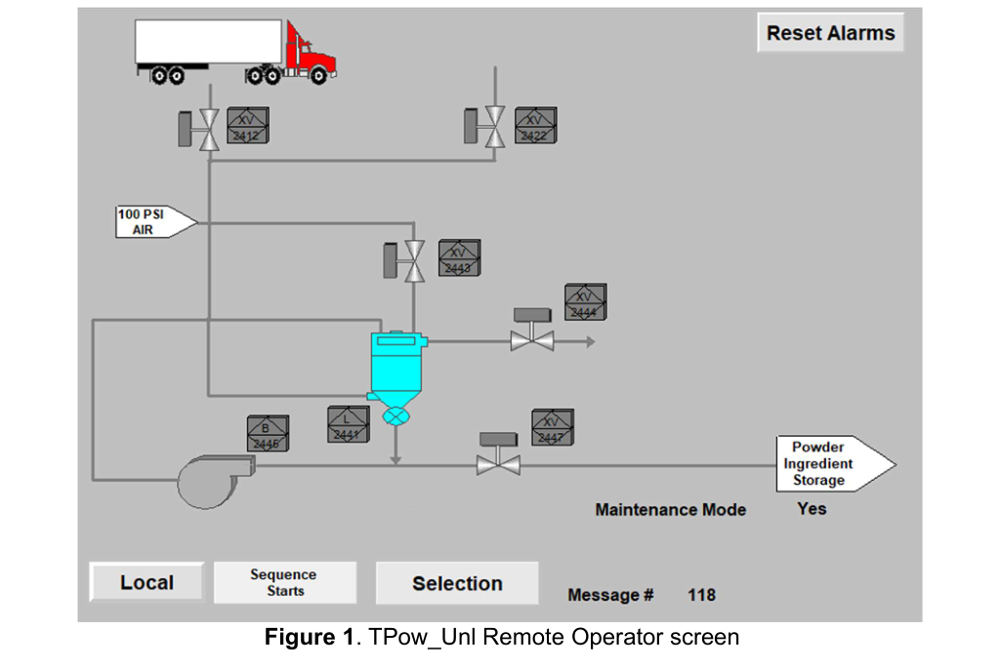
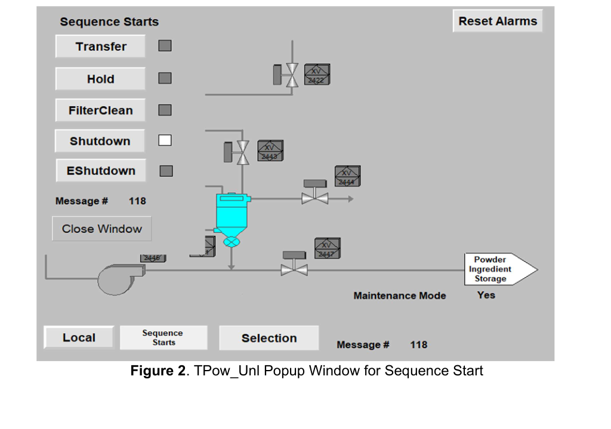
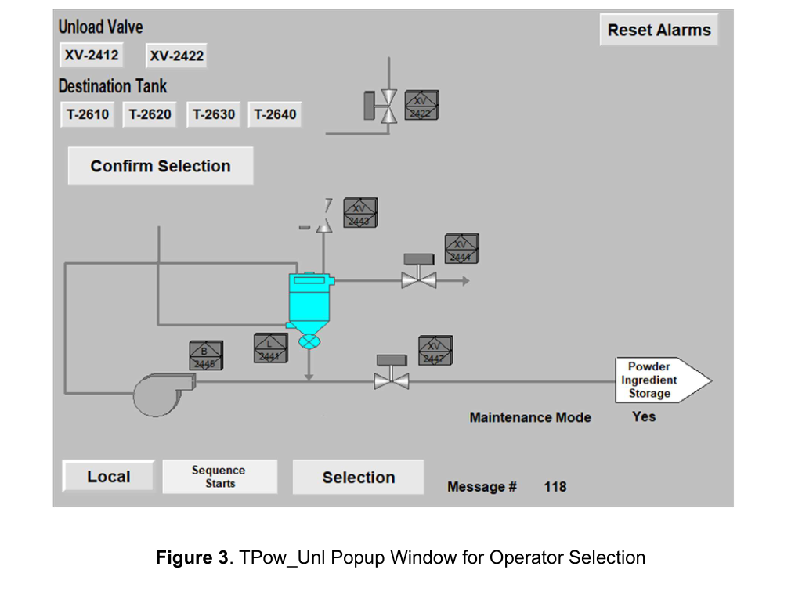
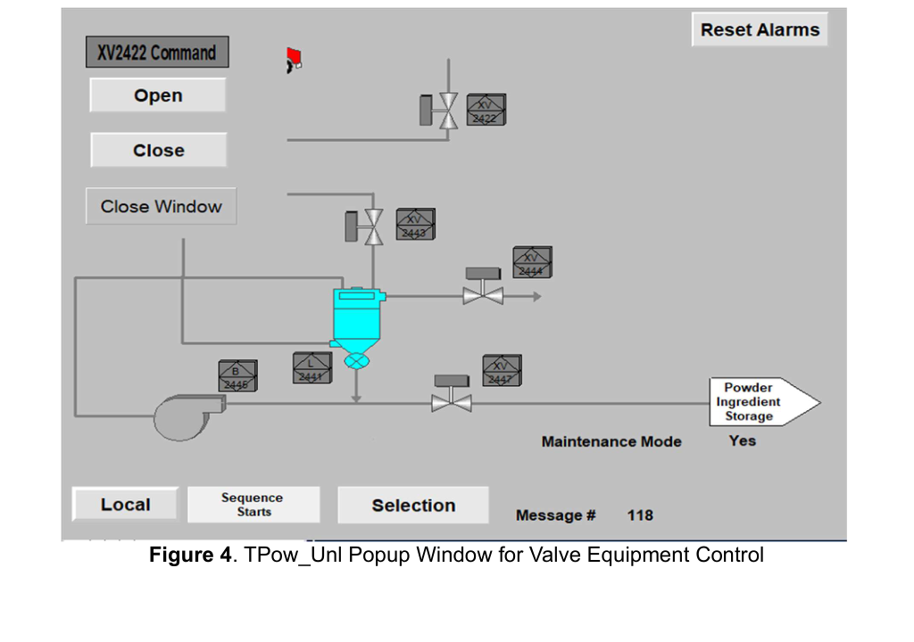
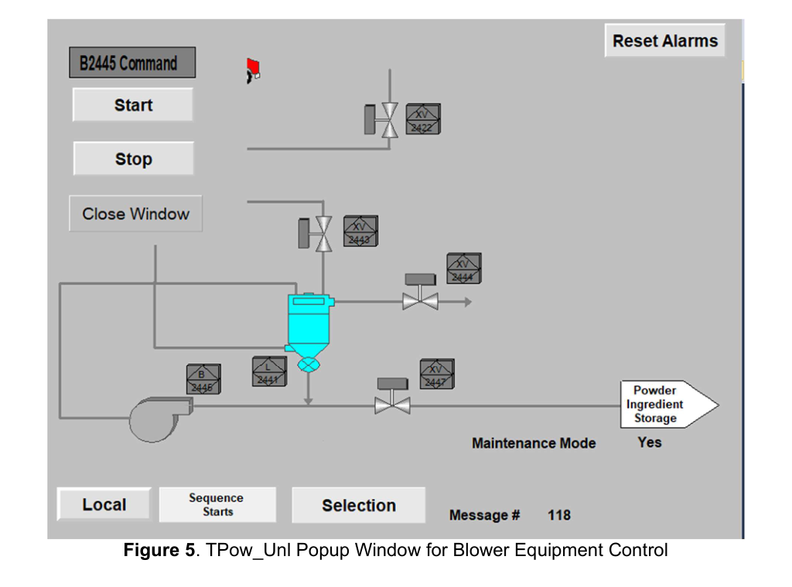

# Truck Powder Ingredient Unload — CompactLogix Control System

**A CompactLogix 5069-L306ER distributed-I/O PLC project that automates pneumatic unloading of a powder-ingredient truck into plant storage tanks, with full Transfer / Hold / FilterClean / Shutdown / E-Shutdown sequencing and a FactoryTalk View HMI.**

---

## Project Overview

This project is a semester-long graduate team build in the *EE 5340 Advanced PLC* lab. The scope was to design, program, simulate, and commission a complete unit-level control system for the **Truck Powder Ingredient Unload** station (`TPow_Unl`) — the plant skid that pneumatically conveys dry powder ingredients out of a tanker trailer, through a vacuum receiver and airlock, and into one of four ingredient storage tanks downstream. The unit is realized on a Rockwell Automation **CompactLogix 5069-L306ER** processor (cell `CmpLogix-11`) that hangs off the main plant `ABClogix4` controller via a **1756-EN2TR** Ethernet/IP bridge in slot 7, and is operated from a dedicated **FactoryTalk View ME** HMI.

The deliverable exercises the full entry-level controls workflow — sequence-diagram authorship, AOI-based device programming, PackML-style state management, HMI screen design, and inter-processor messaging — on a real pneumatic-conveying process that shares destination tanks with a parallel Rail Powder Unload unit, so destination-tank coordination and abnormal-condition handling are first-class concerns rather than afterthoughts.

## Learning Objectives

The project was structured to build competence across the full lifecycle of a unit-level controls job. It was intended to develop working knowledge of CompactLogix 5069 distributed-I/O configuration (Slot 1 input, Slot 2 output, onboard dual Ethernet with linear/DLR topology), application of vendor AOI device libraries (motors, valves, slide gates, flop gates) to stand up a complete device layer quickly, authoring of ISA-TR88 PackML-inspired sequence diagrams as the source of truth for ladder implementation, construction of a FactoryTalk View ME HMI with main overview, command pop-ups, operator selection screens, and alarm reset, use of MSG blocks for inter-processor communication between the CompactLogix unit controller and the plant ControlLogix, and design of an abnormal-conditions framework that distinguishes *Alarm*, *Hold*, and *Shutdown* responses based on the physics of the process.

## System Architecture

The unit is organized around a single **CompactLogix 5069-L306ER** controller that owns all of its own I/O, drives all local field devices, and communicates upstream to the plant ControlLogix through a 1756-EN2TR bridge hosted in slot 7 of the `ABClogix4` chassis. The destination-tank coordination — which one of four ingredient storage tanks the unload is routed to, and the interlock that prevents a simultaneous Rail Powder Unload to the same tank — is handled with MSG reads/writes across that bridge, so the unit controller can make its own sequencing decisions without giving up the plant-wide interlock.

Logically the application follows an ISA-TR88 PackML-inspired layering. A **unit-level sequence supervisor** selects and runs one of five sequences at a time — **Transfer**, **Hold**, **FilterClean**, **Shutdown**, or **E-Shutdown** — each authored as an explicit step diagram in the project spreadsheet and implemented as a step-latched ladder routine. Underneath the sequences is a **device layer** built entirely from vendor AOIs (motor, valve, slide-gate, flop-gate) that exposes a consistent `.Cmd` / `.Status` / `.Fail` interface for every field device so the sequences never touch raw I/O bits. A separate **abnormal-conditions monitor** runs in parallel with whatever sequence is active and elevates low-vacuum, high-discharge-pressure, device-fail, and valve-feedback faults into the appropriate Alarm/Hold/Shutdown response.

### Hardware Stack

The implementation uses a Rockwell Automation **CompactLogix 5069-L306ER** controller (revision 37) as the unit processor. Local I/O is provided by two 5069 modules bolted directly to the controller: a **5069-IB16F** 16-point high-speed 24 V DC sinking input in slot 1 (Series A, Rev 2.001) and a **5069-OB16F** 16-point sourcing output in slot 2 (Series B, Rev 3.001). The controller's two onboard Ethernet ports (`A1/A2`) are configured in **Linear / DLR** mode so the unit can be chained into a device-level ring with neighboring cells without requiring a dedicated ring switch. A **1756-EN2TR** two-port Ethernet/IP bridge in slot 7 of the plant `ABClogix4` chassis provides the handoff up to the plant ControlLogix, and that bridge is the channel for the MSG-based destination-tank handshakes between the Truck Powder and Rail Powder unload unit controllers.

The process equipment under control is a vacuum pneumatic-conveying skid built around two major pieces: a **T-2440** cyclone-type receiver with integrated cartridge filter, and a **B-2445** positive-displacement blower that pulls vacuum on the receiver and pushes powder downstream. A **L-2441** rotary airlock at the base of the receiver isolates vacuum from the destination-tank fill line. Nine motorized valves complete the flow path: two truck-station unload valves (**XV-2412** and **XV-2422**) select which trailer position is being drawn from, **XV-2447** is the truck-station outlet block that must be open whenever the blower is running, **XV-2443** is the receiver purge-inlet valve used during filter-cleaning pulses, **XV-2444** is the receiver vent valve, and four destination-tank fill valves (**XV-2611**, **XV-2621**, **XV-2631**, **XV-2641**) route to ingredient storage tanks **T-2610**, **T-2620**, **T-2630**, and **T-2640** respectively. Instrumentation includes mass-flow meter **FI-2448** (0–300 lb/min) with totalizer **FQI-2448**, vacuum transmitters **PI-2442** (0–15 psi, receiver vacuum) and **PI-2445** (0–15 psi, blower suction), and pressure transmitters **PI-2443** (0–100 psi, purge-air header) and **PI-2446** (0–100 psi, blower discharge).

### Software Stack

The firmware is written in **Ladder Diagram** under Rockwell **Studio 5000 Logix Designer** against the CompactLogix project `TPow_Unl.acd`. All field devices are wrapped in vendor **Add-On Instructions** — motor AOIs for the blower and airlock, valve AOIs for the nine XV valves, and slide-gate / flop-gate AOIs reserved for future expansion — so each sequence routine works only in terms of `.Cmd_Open`, `.Cmd_Close`, `.Sts_Running`, `.Sts_Fail` style interfaces rather than raw output bits. Sequences themselves are carried in **user-defined data types** that bundle the step register, the step timer, the operator commands (Start/Hold/Reset/Stop), the transition flags, and the per-step outputs so that each sequence can be instanced cleanly and dropped into the HMI without bespoke tag plumbing. An **AFI** (Always False Instruction) is used as a diagnostic rung anchor in unfinished branches during development so the ladder can be downloaded and simulated without side effects. Operator interaction runs on **FactoryTalk View ME** through five screens: a main *Remote Operator* screen that renders the full flow path (truck, XV valves, receiver T-2441/T-2446, blower B-2445, 100 psi purge-air header, and the four destination tanks) with animated running/open status and a Reset Alarms button; a *Sequence Starts* pop-up with Transfer / Hold / FilterClean / Shutdown / EShutdown buttons; an *Operator Selection* pop-up for picking the source unload valve (XV-2412 or XV-2422) and the destination tank (T-2610 / T-2620 / T-2630 / T-2640); and device-command pop-ups for individual valves (e.g., XV-2422 Open/Close) and for the blower (B-2445 Start/Stop).

## Phase-by-Phase Progression

### Phase 1 — Sequence Design

The first phase took the control-narrative text and turned it into explicit step diagrams for every mode the unit needs to run. Five sequences were authored in a single Excel workbook, one sheet per sequence, each captured as an ordered list of steps with entry conditions, output actions, transition conditions, and exit destinations. **Transfer** is a nineteen-step flow that clears any lingering operator response, requests the source-valve and destination-tank selection from the operator, verifies the chosen destination tank is below 80% full and that the Rail Powder Unload is not currently running to the same tank, closes all nine valves to a known baseline, zeroes the `FQI-2448` totalizer, opens the selected source valve (XV-2412 or XV-2422) and the truck-outlet block XV-2447, opens the selected destination-tank valve, then brings up the airlock L-2441 and the blower B-2445 in that order, and finally runs until either mass flow drops below 5 lb/min or the destination tank reaches 95%, at which point it auto-chains into **Shutdown**. **Hold** is a fourteen-row sequence that captures the operator's mid-run manipulation options (lifting a single valve, pausing the blower, resuming) with clean exits back to Transfer, forward to Shutdown, or to E-Shutdown. **FilterClean** is a twenty-two-step sequence that opens the receiver vent XV-2444 and then pulses the purge-inlet XV-2443 open for 0.5 s, closed, pause 1 s, three cycles in succession, before auto-chaining into Shutdown. **Shutdown** is a seventeen-step ordered stop that brings the blower down first, then the airlock, then closes the nine valves in a defined sequence so the receiver does not slam shut on vacuum. **E-Shutdown** is a five-step emergency stop that trips the blower and airlock in parallel, closes all nine valves in parallel, and holds a fifteen-second lockout timer before the unit will accept another start.

### Phase 2 — AOI Device Layer & Simulation

The second phase imported the vendor AOI libraries for the motor, valve, slide-gate, and flop-gate device classes and wired every field device into its appropriate AOI instance. Each AOI exposes the standard `.Cmd`, `.Sts`, `.Fail`, and feedback-timeout contracts so the higher-level sequences only ever read status flags and write command bits rather than toggling raw output terminals. An **AFI** rung was dropped in front of any half-implemented device call during development so the ladder could be downloaded, scanned, and simulated without firing physical outputs. Simulation was exercised by forcing input bits for the `Sts_Open` / `Sts_Closed` limit switches on each valve and the `Sts_Running` contact on the blower and airlock, stepping the sequences through in controller tags and confirming that each step's outputs matched the spreadsheet.

### Phase 3 — HMI & Device Command Screens

The third phase built the FactoryTalk View ME application. A main *Remote Operator* screen was drawn in the style of a classic P&ID overview — truck silhouette at left, XV-2412 and XV-2422 unload valves feeding into the T-2441/T-2446 receiver and its integrated bag filter, XV-2443 and XV-2444 on the top of the receiver, the B-2445 blower, the 100 psi purge-air header at upper right, and the four destination storage tanks at far right — with color-animated valve bodies, running-state animation on the blower and airlock, and live numeric fields for `FI-2448`, `FQI-2448`, `PI-2442`, `PI-2443`, `PI-2445`, and `PI-2446`. A global Reset Alarms button and navigation buttons for *Local Control*, *Sequence Starts*, and *Operator Selection* anchor the screen. Two operator-side pop-ups were added: *Sequence Starts* exposes explicit Transfer / Hold / FilterClean / Shutdown / EShutdown request buttons, and *Operator Selection* lets the operator pick one of the two source unload valves and one of the four destination tanks before confirming the selection. Device-level pop-ups (valve Open/Close, blower Start/Stop) were added behind each animated device so the unit can be manipulated device-by-device from *Local Control* when a sequence is not active.

### Phase 4 — Abnormal Conditions & Plant Integration

The fourth phase laid in the abnormal-conditions framework and the plant handshakes. Eight conditions were captured in the spreadsheet and implemented as a parallel monitor routine: receiver vacuum `PI-2442 < 3 psi` with the blower running for 30 s triggers a **Shutdown**; blower-suction vacuum `PI-2445 < 3 psi` with the blower running for 20 s triggers a **Shutdown**; blower-discharge `PI-2446 > 80 psi` for 5 s triggers an **Alarm**; `PI-2446 > 90 psi` for 10 s triggers a **Shutdown**; any motor AOI reporting `Sts_Fail` triggers a **Hold**; any valve AOI reporting `Sts_Fail` triggers a **Hold**; standard Auxiliary / Hand-Off-Auto / Overload events on devices raise an **Alarm**; and valve feedback failures (Fail-To-Open / Fail-To-Close) raise an **Alarm**. The shared-destination-tank interlock was implemented with **MSG** blocks reading the Rail Powder Unload unit's active-destination register out of the plant ControlLogix through the 1756-EN2TR bridge, so the Transfer sequence's "destination clear" precondition directly reflects the plant-wide state rather than a local assumption.

## HMI Screens

The FactoryTalk View ME application was organized around a single flow-path overview with layered command pop-ups. The overview renders the complete skid — truck, the two truck-station unload valves, the 100 PSI purge-air header, the receiver and its integrated bag filter, the receiver vent and purge-inlet valves, the blower, the airlock, the truck-outlet valve, and the arrow out to the Powder Ingredient Storage tanks — with animated valve bodies and running-state feedback. Operator-side pop-ups sit on top of the overview for sequence commanding, source/destination selection, and direct device manipulation in Local Control.

*Figure 1. TPow_Unl Remote Operator screen — full flow-path overview with Local / Sequence Starts / Selection navigation, Reset Alarms button, and Maintenance Mode indicator.*

*Figure 2. Sequence Starts pop-up — explicit Transfer / Hold / FilterClean / Shutdown / EShutdown request buttons with active-sequence indicators.*

*Figure 3. Operator Selection pop-up — choose the source unload valve (XV-2412 or XV-2422) and destination tank (T-2610 / T-2620 / T-2630 / T-2640), then Confirm Selection to arm the Transfer.*

*Figure 4. Valve Command pop-up (XV-2422 shown) — direct Open/Close manipulation of any motorized valve from Local Control.*

*Figure 5. Blower Command pop-up (B-2445) — direct Start/Stop control of the positive-displacement blower when a sequence is not active.*

## Key Technical Accomplishments

The finished system exercises a complete unit-level controls project from empty project file to an HMI-driven, fault-tolerant pneumatic-conveying demo. Specific accomplishments include a correctly commissioned CompactLogix 5069-L306ER unit with a 5069-IB16F input module and a 5069-OB16F output module with matching Series/Revision metadata and onboard Ethernet configured in Linear/DLR topology; a clean AOI-based device layer wrapping the B-2445 blower, the L-2441 airlock, and the nine XV valves with standardized `.Cmd` / `.Sts` / `.Fail` interfaces; five spreadsheet-authored sequences (Transfer, Hold, FilterClean, Shutdown, E-Shutdown) implemented end-to-end in ladder with step registers, step timers, explicit transition conditions, and auto-chain rules between sequences; an abnormal-conditions monitor that correctly discriminates Alarm / Hold / Shutdown responses based on the physics of the vacuum and discharge-pressure circuits; a FactoryTalk View ME HMI with a main flow-path overview, Sequence Starts and Operator Selection pop-ups, and per-device command pop-ups for every valve and motor; and MSG-based inter-processor destination-tank coordination with the Rail Powder Unload unit to prevent the two skids from converging on the same ingredient storage tank.

## Skills Demonstrated

The project exercised a cross-section of core skills for a practicing controls engineer. On the **programming** side it covers Ladder Diagram authorship, Add-On Instruction (AOI) consumption and instancing, User-Defined Type (UDT) design for sequence state, and use of the AFI diagnostic instruction during staged development. On the **sequence-design** side it covers ISA-TR88 / PackML-inspired step-based sequences, explicit entry-condition and transition-condition modeling, auto-chaining between sequences, and operator-intent propagation through Hold / Shutdown / E-Shutdown paths. On the **HMI** side it covers FactoryTalk View ME screen design, live process animation, pop-up command and selection windows, and alarm-reset plumbing. On the **hardware** side it covers CompactLogix 5069 I/O commissioning, Series/Revision management, onboard-Ethernet Linear/DLR topology, and pneumatic-conveying process instrumentation (vacuum, discharge pressure, mass flow, totalizer). On the **networking** side it covers Ethernet/IP and CIP configuration, MSG-block reads and writes across a 1756-EN2TR bridge, and inter-processor interlock design. And on the **safety and reliability** side it covers a structured abnormal-conditions framework that maps specific process-variable excursions and device-feedback failures into Alarm, Hold, and Shutdown responses.

## Tools & Technologies

**Controller & networking:** Rockwell Automation CompactLogix 5069-L306ER (Rev 37) with onboard dual Ethernet (Linear/DLR), 1756-EN2TR Ethernet/IP bridge (ABClogix4 slot 7) for plant handshake to the Rail Powder Unload unit controller.

**Distributed I/O:** 5069-IB16F 16-point 24 V DC high-speed sinking input (Series A, Rev 2.001), 5069-OB16F 16-point sourcing output (Series B, Rev 3.001).

**Process equipment:** T-2440 vacuum receiver with integrated cartridge filter, B-2445 positive-displacement blower, L-2441 rotary airlock, nine motorized block valves (XV-2412 / XV-2422 truck unload, XV-2443 receiver purge inlet, XV-2444 receiver vent, XV-2447 truck-station outlet, XV-2611 / XV-2621 / XV-2631 / XV-2641 destination-tank fill valves), instrumentation FI-2448 / FQI-2448 mass flow + totalizer, PI-2442 / PI-2445 vacuum, PI-2443 / PI-2446 discharge and purge-air pressure.

**Software:** Rockwell Studio 5000 Logix Designer (Ladder Diagram, AOI device libraries, UDT-based sequence objects, AFI diagnostic rungs, MSG inter-processor communications), Rockwell FactoryTalk View ME (overview, sequence-start pop-up, operator-selection pop-up, device-command pop-ups, alarm reset).

**Standards & frameworks:** ISA-TR88.00.02 PackML-inspired sequence modeling, EtherNet/IP and CIP (ODVA), Rockwell Integrated Architecture I/O and AOI conventions.

## Outcome

The final deliverable is a working Truck Powder Ingredient Unload unit that boots cleanly on its CompactLogix controller, presents a complete flow-path overview and device-command HMI to the operator, executes each of the five sequences end-to-end against simulated field I/O, correctly refuses to start a Transfer to a destination tank that the Rail Powder Unload unit is already filling, and elevates low-vacuum, high-discharge-pressure, and device-failure events into the correct Alarm / Hold / Shutdown responses. Beyond the working demo, the most valuable outcome was the end-to-end experience of carrying a control-narrative specification through sequence-diagram authorship, AOI-based ladder implementation, HMI screen design, and plant-level interlock negotiation — the same path an entry-level controls engineer walks on every greenfield skid they deliver.
